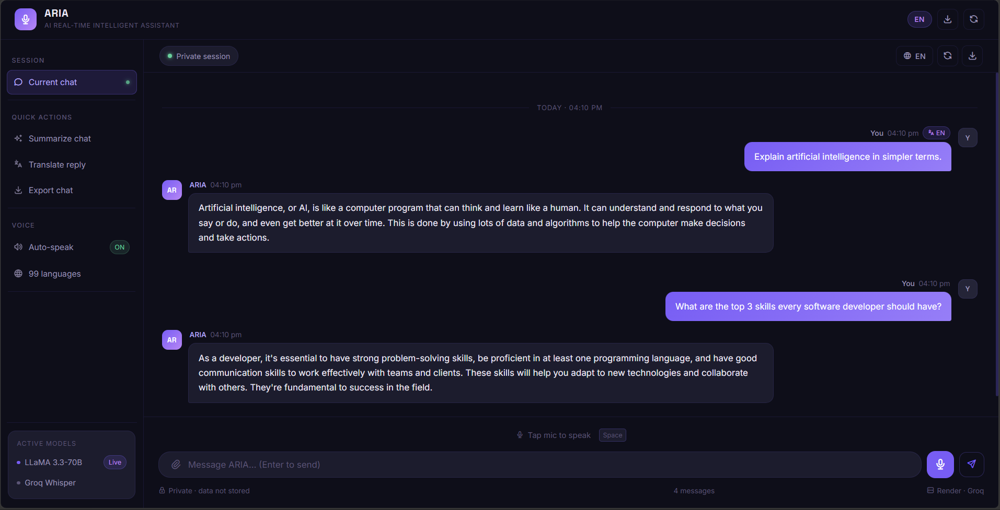

# 🎙️ ARIA – Voice AI Assistant

**Speech-to-Speech AI assistant** built with Groq Whisper + LLaMA 3.3-70B + gTTS/ElevenLabs  
Pipeline: `Your voice → Groq Whisper STT → LLaMA 3.3-70B (Groq) → gTTS/ElevenLabs TTS → Voice response`


🌐 **Live Demo:** [ayush-s-tomar.github.io/aria-voice-assistant](https://ayush-s-tomar.github.io/aria-voice-assistant)  
⚙️ **Backend API:** [aria-voice-assistant-6eze.onrender.com](https://aria-voice-assistant-6eze.onrender.com)  
📖 **API Docs:** [aria-voice-assistant-6eze.onrender.com/docs](https://aria-voice-assistant-6eze.onrender.com/docs)

---



---

## ✨ Features

- 🎤 **Voice input** — record directly from your browser mic with real-time waveform
- 🌍 **99-language support** — speak in Hindi, Spanish, French, English, and more — auto-detected and passed through to TTS
- 🧠 **Persistent memory** — session history stored in Upstash Redis; survives server restarts and redeploys
- 🔊 **Voice output** — responses spoken aloud via gTTS (free) or ElevenLabs multilingual v2 (premium)
- ⚡ **WebSocket streaming** — tokens stream in real time; audio plays sentence-by-sentence as ARIA responds
- 🛠️ **6 built-in tools** — web search (Tavily), calculator, live weather, Wikipedia summaries, current date/time, and unit converter — ARIA picks the right one automatically
- 🔐 **GitHub OAuth** — sign in to persist your session across devices with JWT auth
- 🎭 **Persona customization** — tell ARIA how to speak per session (concise, formal, tutor, Hindi, etc.)
- 🎨 **Dark / light theme** — one click, persisted in localStorage
- 💬 **Text fallback** — type messages if mic isn't available; mic permission errors give step-by-step fix instructions
- ⚡ **TTS caching** — identical phrases skip regeneration, cutting latency and API calls

---

## 🗂️ Project Structure

```
aria-voice-assistant/
├── backend/
│   ├── main.py                  # FastAPI app — HTTP + WebSocket endpoints, auth middleware
│   ├── requirements.txt
│   ├── .env.example
│   └── services/
│       ├── transcriber.py       # Groq Whisper large-v3 STT (99 languages)
│       ├── llm.py               # Groq LLaMA 3.3-70B — streaming, tool use, persona
│       ├── tts.py               # gTTS / ElevenLabs — language passthrough, in-memory cache
│       ├── memory.py            # Upstash Redis — persistent rolling history + persona store
│       ├── tools.py             # 6 tools: web search, calculator, weather, Wikipedia, datetime, unit converter
│       └── auth.py              # GitHub OAuth + JWT creation / verification
├── frontend/
│   └── index.html               # Single-file voice UI — WebSocket, streaming, theme toggle
├── docs/                        # GitHub Pages deployment (copy of frontend)
├── render.yaml                  # One-click Render deploy config
└── README.md
```

---

## 🔋 Tech Stack

| Layer | Tech |
|---|---|
| STT | Groq Whisper large-v3 (cloud, free, 99 languages) |
| LLM | Groq · LLaMA 3.3-70B (streaming + tool use) |
| TTS | gTTS (free) / ElevenLabs multilingual v2 (premium) |
| Memory | Upstash Redis (persistent, survives redeploys) |
| Tools | Tavily web search · calculator · wttr.in weather · Wikipedia REST · datetime · unit converter |
| Auth | GitHub OAuth · JWT sessions |
| API | FastAPI · Uvicorn · WebSockets |
| Frontend | Vanilla HTML/CSS/JS (no framework) |
| Deploy | Render (backend) · GitHub Pages (frontend) |

---

## ⚙️ Local Setup

### Prerequisites
- Python 3.11
- Groq API key → [console.groq.com](https://console.groq.com)
- Upstash Redis database → [upstash.com](https://upstash.com) (free)

### Step 1 — Clone & setup

```powershell
git clone https://github.com/ayush-s-tomar/aria-voice-assistant.git
cd aria-voice-assistant/backend

py -3.11 -m venv venv
venv\Scripts\activate
pip install -r requirements.txt
```

### Step 2 — Configure environment

```powershell
copy .env.example .env
```

Edit `.env`:

```env
# Required
GROQ_API_KEY=your_groq_api_key_here

# Upstash Redis (required for persistent memory)
UPSTASH_REDIS_REST_URL=https://your-db.upstash.io
UPSTASH_REDIS_REST_TOKEN=your_upstash_token_here

# GitHub OAuth (optional — enables login)
GITHUB_CLIENT_ID=your_github_client_id
GITHUB_CLIENT_SECRET=your_github_client_secret
JWT_SECRET=any_random_string_here
FRONTEND_URL=http://localhost:8000

# Optional upgrades
ELEVENLABS_API_KEY=        # leave blank to use free gTTS
ELEVENLABS_VOICE_ID=       # defaults to Rachel
ARIA_NAME=ARIA             # rename the assistant
ARIA_PERSONA_EXTRA=        # append extra instructions to system prompt
SESSION_TTL_HOURS=24       # how long sessions persist in Redis
```

### Step 3 — Run

```powershell
uvicorn main:app --reload --port 8000
```

Then open `frontend/index.html` in Chrome.

---

## 🌐 API Endpoints

| Method | Endpoint | Description |
|---|---|---|
| GET | `/` | Health check |
| GET | `/auth/login` | Redirect to GitHub OAuth |
| GET | `/auth/callback` | OAuth callback — returns JWT |
| GET | `/auth/me` | Current user info from JWT |
| WS | `/ws/{session_id}` | Full streaming pipeline: audio → STT → LLM → TTS chunks |
| POST | `/chat/voice` | HTTP fallback: audio → STT → LLM → TTS → audio |
| POST | `/chat/text` | Text-only: message → LLM response |
| GET | `/session/{id}` | Session metadata (message count, persona, TTL) |
| PUT | `/session/{id}/persona` | Set persona override for this session |
| DELETE | `/session/{id}` | Clear session history and persona |

---

## 🚀 Deploy your own

### 1 — Upstash Redis (memory)
1. Go to [upstash.com](https://upstash.com) → Create database → choose a region
2. Copy **REST URL** and **REST Token** from the database dashboard

### 2 — GitHub OAuth (optional login)
1. Go to GitHub → Settings → Developer Settings → OAuth Apps → New OAuth App
2. Set Homepage URL to your Render URL
3. Set Callback URL to `https://your-render-url.onrender.com/auth/callback`
4. Copy Client ID and Client Secret

### 3 — Backend → Render
1. Fork this repo
2. Go to [render.com](https://render.com) → New → Web Service
3. Connect your fork — `render.yaml` is auto-detected
4. Add env vars in Render dashboard (see `.env.example`)
5. Deploy

### 4 — Frontend → GitHub Pages
1. Update `const API` and `const WS_API` in `frontend/index.html` with your Render URL
2. Copy to `docs/index.html` and push
3. Enable GitHub Pages → branch: `main` → folder: `/docs`

---

## 🧠 How memory works

Each browser tab generates a unique `session_id`. History is stored in **Upstash Redis** as a rolling 20-message window — it persists across server restarts, Render redeploys, and browser refreshes. Authenticated users get namespaced sessions (`user:{github_id}:session:{id}`) so their history is private. Sessions expire after 24 hours by default (configurable via `SESSION_TTL_HOURS`).

---

## 🛠️ Built-in tools

ARIA automatically selects the right tool based on your message — no commands needed.

| Tool | Trigger examples | Requires |
|---|---|---|
| `web_search` | "Latest AI news", "Who won IPL 2025?" | `TAVILY_API_KEY` |
| `calculator` | "15% of 8500", "sqrt(144) + 20" | Nothing |
| `get_weather` | "Weather in Mumbai", "Is it raining in Delhi?" | Nothing — uses wttr.in |
| `wikipedia` | "Who is APJ Abdul Kalam?", "Tell me about black holes" | Nothing |
| `get_datetime` | "What time is it?", "What day is today?" | Nothing |
| `unit_converter` | "100 km to miles", "37°C in Fahrenheit" | Nothing |

---

## 🎭 Persona customization

Hit **Customize ARIA** in the sidebar to give ARIA a per-session tone. Choose a preset (Concise, Casual, Formal, Tutor, Witty, Hindi) or write your own instruction. This calls `PUT /session/{id}/persona` and is stored alongside the session history in Redis. Reset to default any time.

---

## 🔊 Upgrade to premium voice (ElevenLabs)

1. Get API key at [elevenlabs.io](https://elevenlabs.io)
2. Add to `.env`:
   ```env
   ELEVENLABS_API_KEY=your_key_here
   ELEVENLABS_VOICE_ID=21m00Tcm4TlvDq8ikWAM  # Rachel (default)
   ```
3. Restart backend — switches automatically to ElevenLabs multilingual v2, no code changes needed

---

## 🛠️ Built by

**Ayush Singh Tomar** — AI Developer  
[LinkedIn](https://linkedin.com/in/ayushsinghtomar) · [GitHub](https://github.com/ayush-s-tomar) · [Portfolio](https://agentloop.onrender.com)