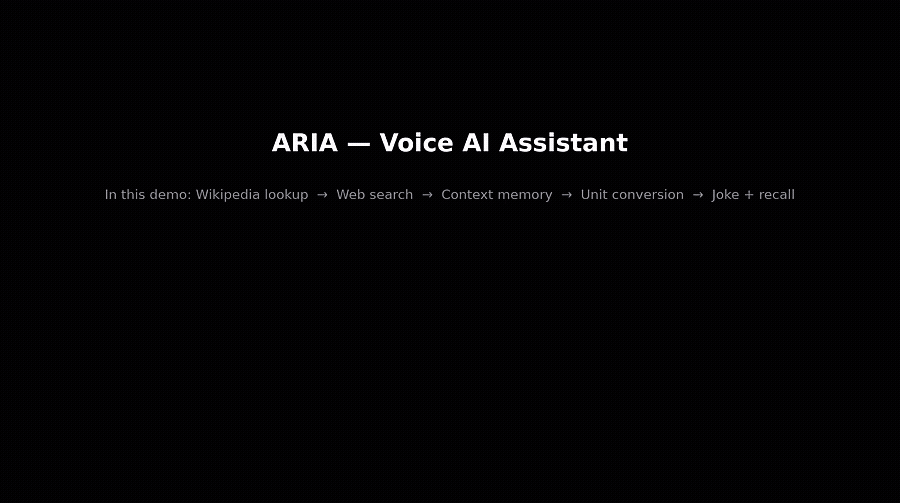

# 🎙️ ARIA — Voice AI Assistant

**Speech-to-Speech AI assistant** built with Groq Whisper + GPT-OSS 120B + gTTS/ElevenLabs

**Pipeline:** Your voice → Groq Whisper STT → GPT-OSS 120B (Groq) → gTTS/ElevenLabs TTS → Voice response

[](https://github.com/ayush-s-tomar/aria-voice-assistant/actions/workflows/ci.yml)
[](https://www.python.org/)
[](https://aria-bot.streamlit.app/)
[](https://groq.com/)
[](https://upstash.com/)
[](LICENSE)
[](https://github.com/ayush-s-tomar/aria-voice-assistant/stargazers)
[](https://github.com/ayush-s-tomar/aria-voice-assistant/commits/main)

🌐 **Try it live:** [aria-bot.streamlit.app](https://aria-bot.streamlit.app/)

> The live demo runs on the Streamlit Community Cloud build (`streamlit-app/`), which is fully self-contained — no separate backend required. The FastAPI backend (`backend/`) and WebSocket frontend (`frontend/`) are included in this repo for self-hosting (see [Deploy your own](#-deploy-your-own)) but are not currently hosted publicly.

---

## 🎬 Demo



**Full walkthrough video:**

[▶️ Watch the demo](https://github.com/user-attachments/assets/9b895558-3266-4002-9a06-5e0ee013c635)

---

## ✨ Features

- 🎤 **Voice input** — record directly from your browser mic
- 🌍 **99-language support** — speak in Hindi, Spanish, French, English, and more — auto-detected and passed through to TTS
- 🧠 **Persistent memory** — session history stored in Upstash Redis; survives restarts and redeploys
- 🔊 **Voice output** — responses spoken aloud via gTTS (free) or ElevenLabs multilingual v2 (premium)
- 🛠️ **6 built-in tools** — web search (Tavily), calculator, live weather, Wikipedia summaries, current date/time, and unit converter — ARIA picks the right one automatically
- 🎭 **Persona customization** — tell ARIA how to speak per session (concise, formal, tutor, Hindi, etc.)
- 💬 **Text fallback** — type messages if mic isn't available
- ⚡ **TTS caching** — identical phrases skip regeneration, cutting latency and API calls

*(The FastAPI backend additionally supports GitHub OAuth, WebSocket token streaming, and dark/light theme toggling — see [Project Structure](#️-project-structure) below.)*

---

## 🗂️ Project Structure

```
aria-voice-assistant/
├── streamlit-app/                # Live deployment target — Streamlit Community Cloud
│   ├── streamlit_app.py          # Single-file voice UI: mic input, chat, sidebar, persona
│   └── services/
│       ├── transcriber.py        # Groq Whisper large-v3 STT (99 languages)
│       ├── llm.py                # Groq GPT-OSS 120B — tool use, persona
│       ├── tts.py                # gTTS / ElevenLabs — language passthrough, caching
│       └── memory.py             # Upstash Redis — persistent rolling history + persona store
├── backend/                      # FastAPI backend (self-host only, not publicly deployed)
│   ├── main.py                   # HTTP + WebSocket endpoints, auth middleware
│   └── services/                 # Same services as above, plus auth.py (GitHub OAuth + JWT)
├── frontend/
│   └── index.html                # Single-file WebSocket voice UI (pairs with backend/)
├── assets/                       # Demo GIF, screenshot, and other README media
├── docs/                         # GitHub Pages deployment (copy of frontend) + demo assets
├── .github/workflows/ci.yml      # CI — lint + import check on every push/PR
├── render.yaml                   # Render deploy config (for self-hosting the backend)
├── LICENSE                       # MIT
└── README.md
```

---

## 🔋 Tech Stack

| Layer     | Tech                                                              |
| --------- | ------------------------------------------------------------------ |
| STT       | Groq Whisper large-v3 (cloud, free, 99 languages)                  |
| LLM       | Groq · GPT-OSS 120B (tool use)                                     |
| TTS       | gTTS (free) / ElevenLabs multilingual v2 (premium)                 |
| Memory    | Upstash Redis (persistent, survives redeploys)                     |
| Tools     | Tavily web search · calculator · wttr.in weather · Wikipedia REST · datetime · unit converter |
| API (self-host) | FastAPI · Uvicorn · WebSockets · GitHub OAuth · JWT sessions |
| Frontend  | Streamlit (live) / Vanilla HTML/CSS/JS (self-host WebSocket variant) |
| CI/CD     | GitHub Actions (lint + import check) · Streamlit Community Cloud |

---

## ⚙️ Local Setup (Streamlit — matches the live demo)

### Prerequisites
- Python 3.11
- Groq API key → [console.groq.com](https://console.groq.com)
- Upstash Redis database → [upstash.com](https://upstash.com) (free)

### Step 1 — Clone & setup
```bash
git clone https://github.com/ayush-s-tomar/aria-voice-assistant.git
cd aria-voice-assistant/streamlit-app

py -3.11 -m venv venv
venv\Scripts\activate
pip install -r requirements.txt
```

### Step 2 — Configure secrets
Create `.streamlit/secrets.toml` inside `streamlit-app/`:
```toml
GROQ_API_KEY = "your_groq_api_key_here"
UPSTASH_REDIS_REST_URL = "https://your-db.upstash.io"
UPSTASH_REDIS_REST_TOKEN = "your_upstash_token_here"
TAVILY_API_KEY = "your_tavily_key_here"
ELEVENLABS_API_KEY = ""        # leave blank to use free gTTS
ELEVENLABS_VOICE_ID = ""       # defaults to Rachel
ARIA_NAME = "ARIA"             # rename the assistant
ARIA_PERSONA_EXTRA = ""        # append extra instructions to system prompt
SESSION_TTL_HOURS = "24"       # how long sessions persist in Redis
```

### Step 3 — Run
```bash
streamlit run streamlit_app.py
```
Opens at `http://localhost:8501`.

---

## 🚀 Deploy your own

### 1 — Upstash Redis (memory)
- Go to [upstash.com](https://upstash.com) → Create database → choose a region
- Copy REST URL and REST Token from the database dashboard

### 2 — Streamlit Community Cloud (recommended — matches the live demo)
- [share.streamlit.io](https://share.streamlit.io) → New app → connect your fork
- Main file path: `streamlit-app/streamlit_app.py`
- Add the same keys shown in Step 2 above under **Settings → Secrets** (TOML format)
- Deploy — live at your `*.streamlit.app` URL

### 3 — FastAPI backend (optional, self-host only)
- Go to [render.com](https://render.com) → New → Web Service → connect your fork
- `render.yaml` is auto-detected; add the same env vars from `.env.example` in `backend/`
- Pairs with `frontend/index.html` (update `const API` / `const WS_API` with your Render URL) or GitHub Pages via `docs/`

---

## 🧠 How memory works

Each browser tab generates a unique `session_id`. History is stored in Upstash Redis as a rolling 20-message window — it persists across restarts and redeploys. Sessions expire after 24 hours by default (configurable via `SESSION_TTL_HOURS`).

---

## 🛠️ Built-in tools

ARIA automatically selects the right tool based on your message — no commands needed.

| Tool             | Trigger examples                                  | Requires             |
| ----------------- | --------------------------------------------------- | ---------------------- |
| `web_search`       | "Latest AI news", "Who won IPL 2025?"                 | `TAVILY_API_KEY`         |
| `calculator`        | "15% of 8500", "sqrt(144) + 20"                       | Nothing                  |
| `get_weather`        | "Weather in Mumbai", "Is it raining in Delhi?"          | Nothing — uses wttr.in     |
| `wikipedia`           | "Who is APJ Abdul Kalam?", "Tell me about black holes"    | Nothing                     |
| `get_datetime`         | "What time is it?", "What day is today?"                    | Nothing                       |
| `unit_converter`        | "100 km to miles", "37°C in Fahrenheit"                        | Nothing                          |

---

## 🎭 Persona customization

Choose a preset (Concise, Casual, Formal, Tutor, Witty, Hindi) or write your own instruction in the sidebar. Persona is stored alongside session history in Redis and applies to every reply until reset.

---

## 🔊 Upgrade to premium voice (ElevenLabs)

1. Get an API key at [elevenlabs.io](https://elevenlabs.io)
2. Add to your secrets:
   ```toml
   ELEVENLABS_API_KEY = "your_key_here"
   ELEVENLABS_VOICE_ID = "21m00Tcm4TlvDq8ikWAM"  # Rachel (default)
   ```
3. Select "ElevenLabs" in the sidebar's Voice engine option — no code changes needed

---

## ✅ CI/CD

Every push and PR to `main` runs [`.github/workflows/ci.yml`](.github/workflows/ci.yml), which installs dependencies, lints with `ruff`, and verifies the app imports cleanly. Streamlit Community Cloud auto-redeploys on every push to `main`.

---

## 📄 License

MIT — see [LICENSE](LICENSE) for details.

---

## 🛠️ Built by

**Ayush Singh Tomar** — AI Developer
[LinkedIn](https://linkedin.com/in/ayush-s-tomar) · [GitHub](https://github.com/ayush-s-tomar) · [Portfolio](https://ayush-s-tomar.vercel.app)